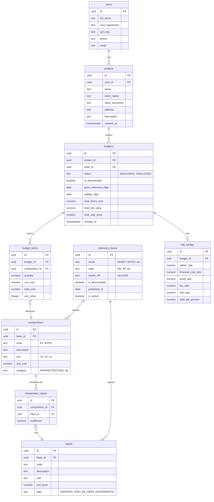

# PLAN: Plataforma de Orçamentação de Engenharia (CREA-MA)

> **PRD:** [prd.md](file:///d:/CREA%20-%20Or%C3%A7amentos/prd.md)
> **Data:** 2026-03-29
> **Tipo do Projeto:** WEB (Next.js App Router + Supabase)
> **Modo:** PLANNING ONLY — nenhum código será escrito nesta fase.

---

## Visão Geral

Construir uma **PWA mobile-first** que guia engenheiros civis (CREA-MA) na elaboração de orçamentos técnicos padronizados, utilizando bases SINAPI/SICRO, cálculo de BDI/Encargos e exportação de PDF oficial.

### Critérios de Sucesso

| # | Critério | Métrica |
|---|----------|---------|
| 1 | Wizard de 6 etapas funcional end-to-end | Usuário cria orçamento completo em < 10 min |
| 2 | PDF gerado segue padrão CONFEA/CREA | Todos os campos obrigatórios presentes |
| 3 | Schema suporta SINAPI + futuras bases | Tabelas `reference_bases` isoladas |
| 4 | PWA instalável e responsiva | Lighthouse PWA score ≥ 90 |
| 5 | Importação CSV funcional | Admin importa tabela SINAPI via CSV |

---

## Tech Stack

| Camada | Tecnologia | Justificativa |
|--------|-----------|---------------|
| **Framework** | Next.js 15 (App Router) | SSR/SSG, Server Components, API Routes |
| **Estilo** | TailwindCSS v4 | Utility-first, design tokens, mobile-first |
| **Database** | Supabase (PostgreSQL 17) | RLS, Auth integrado, Realtime, região `sa-east-1` |
| **Auth** | Supabase Auth | E-mail/senha, OAuth Google, proteção por RLS |
| **PDF** | `@react-pdf/renderer` | Geração client/server-side com formatação precisa |
| **PWA** | `next-pwa` / `@serwist/next` | Service Worker, manifest, offline-first |
| **Deploy** | Vercel | Edge Network, integração nativa Next.js |
| **Validação** | Zod | Schema validation TypeScript-first |
| **State** | React Context + URL State | Wizard multi-step com estado persistido na URL |

---

## Estrutura de Arquivos (Proposta)

```
crea-orcamentos/
├── public/
│   ├── manifest.json                    # PWA manifest
│   ├── icons/                           # PWA icons (192, 512)
│   └── sw.js                            # Service Worker (gerado)
├── src/
│   ├── app/
│   │   ├── layout.tsx                   # Root layout (fonts, metadata, PWA)
│   │   ├── page.tsx                     # Landing / Dashboard
│   │   ├── (auth)/
│   │   │   ├── login/page.tsx
│   │   │   └── register/page.tsx
│   │   ├── (dashboard)/
│   │   │   ├── layout.tsx               # Dashboard shell (nav, sidebar)
│   │   │   ├── projetos/page.tsx        # Lista de projetos/orçamentos
│   │   │   └── novo-orcamento/
│   │   │       ├── layout.tsx           # Wizard layout (progress bar)
│   │   │       ├── page.tsx             # Redireciona para etapa 1
│   │   │       ├── etapa-1/page.tsx     # Setup da Obra
│   │   │       ├── etapa-2/page.tsx     # Assistente de Serviços
│   │   │       ├── etapa-3/page.tsx     # Quantitativos
│   │   │       ├── etapa-4/page.tsx     # Custo Direto
│   │   │       ├── etapa-5/page.tsx     # BDI / Fechamento
│   │   │       └── etapa-6/page.tsx     # Emissão PDF
│   │   ├── admin/
│   │   │   └── importar/page.tsx        # Import CSV (SINAPI/SICRO)
│   │   └── api/
│   │       ├── import-csv/route.ts      # API de importação CSV
│   │       └── generate-pdf/route.ts    # Geração PDF server-side (fallback)
│   ├── components/
│   │   ├── ui/                          # Componentes base (Button, Input, Card, Modal)
│   │   ├── wizard/                      # Componentes do Wizard
│   │   │   ├── WizardShell.tsx          # Container com progress tracker
│   │   │   ├── StepNavigation.tsx       # Botões anterior/próximo
│   │   │   └── ServiceSearch.tsx        # Busca inteligente de composições
│   │   ├── pdf/                         # Templates PDF
│   │   │   ├── OrcamentoDocument.tsx    # Documento principal (@react-pdf)
│   │   │   ├── CoverPage.tsx            # Capa com dados profissionais
│   │   │   └── PlanilhaTable.tsx        # Tabela de itens detalhada
│   │   └── layout/                      # Header, Footer, MobileNav
│   ├── lib/
│   │   ├── supabase/
│   │   │   ├── client.ts               # createBrowserClient
│   │   │   ├── server.ts               # createServerClient
│   │   │   └── middleware.ts            # Auth middleware
│   │   ├── calculations/
│   │   │   ├── bdi.ts                   # Motor de cálculo BDI
│   │   │   ├── encargos.ts              # Cálculo encargos sociais
│   │   │   └── orcamento.ts             # Composição de custos
│   │   ├── csv/
│   │   │   └── sinapi-parser.ts         # Parser CSV → PostgreSQL
│   │   └── validations/
│   │       ├── orcamento.schema.ts      # Zod schemas
│   │       └── user.schema.ts
│   ├── hooks/
│   │   ├── useWizard.ts                 # Estado do wizard (step, data)
│   │   ├── useOrcamento.ts              # CRUD orçamento
│   │   └── useSinapiSearch.ts           # Busca composições SINAPI
│   └── types/
│       ├── database.ts                  # Tipos gerados do Supabase
│       ├── orcamento.ts                 # Tipos do domínio
│       └── sinapi.ts                    # Tipos SINAPI/SICRO
├── scripts/
│   └── import-sinapi.ts                 # Script CLI de importação CSV
├── supabase/
│   └── migrations/                      # SQL migrations
├── docs/
│   └── PLAN-orcamento-engenharia.md     # Este arquivo
├── next.config.ts
├── tailwind.config.ts
├── tsconfig.json
└── package.json
```

---

## Schema do Banco de Dados (PostgreSQL via Supabase)

> [!IMPORTANT]
> **Restrição de Dados:** NÃO serão criados scripts de seed com dados reais SINAPI/SICRO. O schema será otimizado para receber dados via importação CSV pelo administrador.

### Diagrama ER



### Princípios do Schema

1. **Isolamento de Bases** — `reference_bases` como tabela central permite SINAPI, SICRO e futuras bases sem refatoração.
2. **Composição Granular** — `composition_inputs` com coeficientes permite cálculo transparente de custo unitário.
3. **Multitenant via RLS** — `user_id` em `projects` + policies RLS garantem isolamento de dados por usuário.
4. **Importação Batch-Friendly** — Tabelas `compositions`, `inputs`, `composition_inputs` desenhadas para bulk insert via CSV.
5. **Índices Planejados** — GIN index em `description` para busca textual, B-tree em `code` e `base_id`.

---

## Módulo de Importação CSV

> [!IMPORTANT]
> O sistema **NÃO** incluirá dados SINAPI/SICRO embutidos. Em vez disso, fornecerá uma ferramenta de importação robusta.

### Estratégia de Importação

| Componente | Descrição |
|-----------|-----------|
| **Script CLI** | `scripts/import-sinapi.ts` — Roda localmente via `npx tsx` |
| **API Route** | `api/import-csv/route.ts` — Upload via interface admin |
| **Parser** | `lib/csv/sinapi-parser.ts` — Mapeia colunas CSV → schema |
| **UI Admin** | `admin/importar/page.tsx` — Drag & drop com preview |

### Fluxo de Importação

```
CSV Upload → Validação (Zod) → Preview (primeiras 10 linhas)
    → Confirmação → Bulk UPSERT (on conflict code + base_id)
    → Relatório (inseridos / atualizados / erros)
```

### Formato CSV Esperado

**Composições (`compositions`):**
```csv
CODIGO,DESCRICAO,UNIDADE,CUSTO_UNITARIO,CATEGORIA
87878,"ARGAMASSA TRAÇO 1:4",M3,450.32,REVESTIMENTO
```

**Insumos (`inputs`):**
```csv
CODIGO,DESCRICAO,UNIDADE,PRECO_UNITARIO,TIPO
00000370,CIMENTO PORTLAND CP II-32,KG,0.72,MATERIAL
```

**Composições × Insumos (`composition_inputs`):**
```csv
CODIGO_COMPOSICAO,CODIGO_INSUMO,COEFICIENTE
87878,00000370,8.22
```

---

## Geração de PDF (`@react-pdf/renderer`)

### Arquitetura

```
Etapa 6 (Emissão) → Monta dados do orçamento
    → Client-side: <PDFDownloadLink> com OrcamentoDocument
    → Server-side (fallback): API Route renderiza via renderToStream
```

### Estrutura do Documento PDF

| Seção | Conteúdo |
|-------|----------|
| **Capa** | Logo CREA-MA, Nome do Profissional, CREA, CPF/CNPJ |
| **Dados da Obra** | Cliente, Endereço, Descrição da obra |
| **Planilha Detalhada** | Item, Descrição, Unidade, Qtd, Custo Unit., Custo Total |
| **Composição BDI** | Tabela com cada componente do BDI e percentuais |
| **Resumo** | Total Custo Direto, Total BDI, Preço de Venda |
| **Rodapé** | Base utilizada (SINAPI MA Jan/2026), Data ref., Validade |

### Regras de Negócio do PDF

- [ ] Número de páginas automático
- [ ] Formatação monetária brasileira (R$ 1.234,56)
- [ ] Quebra de tabela entre páginas com cabeçalho repetido
- [ ] Marca d'água "RASCUNHO" se `status !== FINALIZADO`

---

## Motor de Cálculo

### Fórmulas Principais

```
Custo Unitário da Composição = Σ (preço_insumo × coeficiente)
Custo Total do Item = custo_unitário × quantidade
Custo Direto Total = Σ (custos_totais_itens)

BDI (%) = ((1 + AC + S + R + G) × (1 + DF) × (1 + L)) / (1 - I) - 1

Onde:
  AC = Administração Central
  S  = Seguros
  R  = Riscos
  G  = Garantias
  DF = Despesas Financeiras
  L  = Lucro
  I  = Impostos (ISS + PIS + COFINS + CPRB)

Preço de Venda = Custo Direto × (1 + BDI)
```

---

## Sprints de Implementação

---

### 🏗️ Sprint 1 — Setup, Database e Autenticação (Fundação)

**Duração estimada:** 8-12 horas
**Objetivo:** Projeto Next.js configurado como PWA, banco de dados criado no Supabase com schema completo, autenticação funcional.

| # | Tarefa | Agente | Skill |
|---|--------|--------|-------|
| 1.1 | Criar projeto Next.js (App Router) + TailwindCSS v4 + TypeScript strict | `frontend-specialist` | `nextjs-best-practices` |
| 1.2 | Configurar PWA (manifest.json, service worker, meta tags, icons) | `frontend-specialist` | `frontend-design` |
| 1.3 | Criar projeto Supabase (`sa-east-1`), configurar variáveis de ambiente | `backend-specialist` | `database-design` |
| 1.4 | Aplicar migration: schema completo (todas as tabelas, índices, constraints) | `database-architect` | `database-design` |
| 1.5 | Configurar RLS policies (isolamento por `user_id`) | `database-architect` | `database-design` |
| 1.6 | Implementar Supabase Auth (login, registro, middleware de sessão) | `backend-specialist` | `api-patterns` |
| 1.7 | Gerar tipos TypeScript do Supabase (`supabase gen types`) | `backend-specialist` | `clean-code` |
| 1.8 | Instalar e configurar `@react-pdf/renderer` + verificar build | `frontend-specialist` | `clean-code` |

#### Detalhamento INPUT → OUTPUT → VERIFY

**- [ ] Tarefa 1.1 — Setup Next.js**
- **INPUT:** `npx -y create-next-app@latest ./ --typescript --tailwind --eslint --app --src-dir --import-alias "@/*"`
- **OUTPUT:** Projeto Next.js rodando em `localhost:3000`
- **VERIFY:** `npm run dev` abre sem erros; `npm run build` compila com sucesso

**- [ ] Tarefa 1.4 — Migration Schema**
- **INPUT:** SQL de criação de tabelas conforme diagrama ER acima
- **OUTPUT:** Todas as tabelas criadas no Supabase com constraints e índices
- **VERIFY:** `SELECT table_name FROM information_schema.tables WHERE table_schema = 'public'` retorna todas as tabelas; FK constraints ativas

**- [ ] Tarefa 1.5 — RLS Policies**
- **INPUT:** Policies vinculando `auth.uid()` ao `user_id` via `projects`
- **OUTPUT:** Usuário A não vê dados do Usuário B
- **VERIFY:** Teste com 2 usuários diferentes no Supabase Dashboard; query com service_role confirma dados separados

**- [ ] Tarefa 1.6 — Auth**
- **INPUT:** Supabase Auth com e-mail/senha
- **OUTPUT:** Páginas `/login` e `/register` funcionais, middleware protegendo rotas
- **VERIFY:** Registrar usuário → Login → Acessar dashboard → Logout → Rota protegida redireciona para login

---

### 🎨 Sprint 2 — UI Base e Navegação (Estrutura Visual)

**Duração estimada:** 8-12 horas
**Objetivo:** Design system definido, componentes base criados, navegação completa (dashboard + wizard shell).

> [!IMPORTANT]
> **Identidade Visual:** Paleta institucional CREA-MA (azul, cinza, branco). Design sóbrio e confiável. **Purple Ban ativo.**

| # | Tarefa | Agente | Skill |
|---|--------|--------|-------|
| 2.1 | Definir design tokens TailwindCSS (cores CREA-MA, tipografia, espaçamento) | `frontend-specialist` | `tailwind-patterns` |
| 2.2 | Criar componentes UI base (Button, Input, Select, Card, Modal, Tooltip) | `frontend-specialist` | `frontend-design` |
| 2.3 | Implementar layout do Dashboard (header, mobile nav, lista de projetos) | `frontend-specialist` | `frontend-design` |
| 2.4 | Criar WizardShell (progress tracker de 6 etapas, navegação step-by-step) | `frontend-specialist` | `frontend-design` |
| 2.5 | Implementar componente de Tooltip educativo (ícone "i" com explicações contextuais) | `frontend-specialist` | `frontend-design` |
| 2.6 | Criar página de listagem de projetos/orçamentos com estados vazios | `frontend-specialist` | `nextjs-best-practices` |
| 2.7 | Implementar `useWizard` hook (gerenciamento de estado multi-step via URL) | `frontend-specialist` | `react-patterns` |

#### Detalhamento INPUT → OUTPUT → VERIFY

**- [ ] Tarefa 2.1 — Design Tokens**
- **INPUT:** Cores oficiais CREA-MA (pesquisar referências), escala tipográfica com fonte Inter/Outfit
- **OUTPUT:** `tailwind.config.ts` com `colors.crea`, `fontFamily`, `spacing` customizados
- **VERIFY:** Aplicar classes `bg-crea-primary`, `text-crea-secondary` em componente de teste; cores corretas no DevTools

**- [ ] Tarefa 2.4 — WizardShell**
- **INPUT:** Layout com barra de progresso de 6 etapas (Setup, Serviços, Quantitativos, Custo, BDI, Emissão)
- **OUTPUT:** Componente `WizardShell` com indicação visual da etapa atual, navegação anterior/próximo
- **VERIFY:** Navegar entre etapas mantém estado; barra de progresso reflete etapa correta; mobile-first responsivo

**- [ ] Tarefa 2.7 — useWizard Hook**
- **INPUT:** Gerenciar `currentStep`, `formData` (parcial por etapa), navegação
- **OUTPUT:** Hook `useWizard()` retornando `{ step, data, next, prev, setData, isValid }`
- **VERIFY:** Dados persistem entre steps; refresh da página mantém estado (via URL/sessionStorage)

---

### ⚙️ Sprint 3 — Wizard de Orçamento e Motor de Cálculo (Core Business)

**Duração estimada:** 12-16 horas
**Objetivo:** As 6 etapas do wizard implementadas com lógica de cálculo completa. Busca de composições SINAPI funcional. Módulo de importação CSV operacional.

| # | Tarefa | Agente | Skill |
|---|--------|--------|-------|
| 3.1 | Etapa 1 (Setup): Formulário de cabeçalho da obra + seleção de base/regime | `frontend-specialist` | `frontend-design` |
| 3.2 | Etapa 2 (Serviços): Busca textual de composições SINAPI com debounce + seleção | `frontend-specialist` + `backend-specialist` | `api-patterns` |
| 3.3 | Implementar busca full-text em `compositions` (pg_trgm + GIN index) | `database-architect` | `database-design` |
| 3.4 | Etapa 3 (Quantitativos): Lista de itens selecionados com input de quantidade | `frontend-specialist` | `frontend-design` |
| 3.5 | Etapa 4 (Custo Direto): Exibição transparente do cálculo (insumos × coeficientes) | `frontend-specialist` + `backend-specialist` | `clean-code` |
| 3.6 | Implementar motor de cálculo (`lib/calculations/`) | `backend-specialist` | `clean-code` |
| 3.7 | Etapa 5 (BDI): Configuração interativa do BDI com tooltips educativos | `frontend-specialist` | `frontend-design` |
| 3.8 | Implementar cálculo BDI com validação de faixas recomendadas | `backend-specialist` | `clean-code` |
| 3.9 | Criar módulo de importação CSV (parser + API route + UI admin) | `backend-specialist` + `frontend-specialist` | `api-patterns` |
| 3.10 | Persistir orçamento no Supabase (Server Actions para CRUD) | `backend-specialist` | `api-patterns` |

#### Detalhamento INPUT → OUTPUT → VERIFY

**- [ ] Tarefa 3.2 — Busca de Serviços**
- **INPUT:** Campo de busca textual com debounce (300ms)
- **OUTPUT:** Lista de composições filtradas por descrição, com código, unidade e custo
- **VERIFY:** Digitar "argamassa" retorna composições relevantes; performance < 200ms com 50k+ registros

**- [ ] Tarefa 3.6 — Motor de Cálculo**
- **INPUT:** `compositions` + `composition_inputs` + quantidades do usuário
- **OUTPUT:** Funções `calculateUnitCost()`, `calculateDirectCost()`, `calculateBDI()`, `calculateSalePrice()`
- **VERIFY:** Testes unitários com valores conhecidos do SINAPI; resultado bate com cálculo manual

**- [ ] Tarefa 3.9 — Importação CSV**
- **INPUT:** Arquivo CSV no formato definido (seção "Módulo de Importação CSV")
- **OUTPUT:** Registros inseridos/atualizados nas tabelas `compositions`, `inputs`, `composition_inputs`
- **VERIFY:** Upload de CSV de teste → preview correto → confirmação → dados no banco; re-upload faz UPSERT sem duplicar

---

### 📄 Sprint 4 — Exportação PDF, Polish e Verificação

**Duração estimada:** 8-10 horas
**Objetivo:** PDF padronizado gerado com `@react-pdf/renderer`. Etapa 6 completa. Micro-interações, selos e revisão final.

| # | Tarefa | Agente | Skill |
|---|--------|--------|-------|
| 4.1 | Etapa 6 (Emissão): Tela de preview + botão de download PDF | `frontend-specialist` | `frontend-design` |
| 4.2 | Criar template PDF completo (`OrcamentoDocument.tsx`) | `frontend-specialist` | `clean-code` |
| 4.3 | Implementar seções do PDF (Capa, Planilha, BDI, Resumo, Rodapé) | `frontend-specialist` | `clean-code` |
| 4.4 | API Route de fallback para geração server-side (`renderToStream`) | `backend-specialist` | `api-patterns` |
| 4.5 | Implementar histórico/templates de orçamentos (SHOULD HAVE) | `backend-specialist` + `frontend-specialist` | `api-patterns` |
| 4.6 | Adicionar micro-interações profissionais (transições de etapas, validação visual) | `frontend-specialist` | `frontend-design` |
| 4.7 | Implementar selo "Primeiro Voo" (primeiro orçamento finalizado) | `frontend-specialist` | `frontend-design` |
| 4.8 | Revisão de acessibilidade (ARIA, keyboard nav, contraste) | `frontend-specialist` | `frontend-design` |
| 4.9 | Otimização de performance (Lighthouse PWA ≥ 90) | `frontend-specialist` | `performance-profiling` |

#### Detalhamento INPUT → OUTPUT → VERIFY

**- [ ] Tarefa 4.2 — Template PDF**
- **INPUT:** Dados completos do orçamento (projeto, itens, BDI, totais)
- **OUTPUT:** Documento PDF com layout profissional, formatação monetária BR, paginação automática
- **VERIFY:** Abrir PDF gerado; verificar campos obrigatórios do PRD §3.1.4; tabela quebra corretamente entre páginas

**- [ ] Tarefa 4.3 — Seções PDF**
- **INPUT:** Componentes `@react-pdf/renderer` (Document, Page, View, Text, StyleSheet)
- **OUTPUT:** Capa com identificação profissional; Planilha detalhada; Composição BDI; Resumo com totais
- **VERIFY:** Comparar com modelo de referência do CREA; todos os campos obrigatórios presentes

**- [ ] Tarefa 4.9 — Performance PWA**
- **INPUT:** App rodando em `localhost:3000`
- **OUTPUT:** Lighthouse scores: Performance ≥ 80, PWA ≥ 90, Accessibility ≥ 85
- **VERIFY:** `python .agent/skills/performance-profiling/scripts/lighthouse_audit.py http://localhost:3000`

---

## Phase X: Verificação Final

> [!CAUTION]
> **NÃO marque o projeto como completo** sem executar TODOS os scripts abaixo.

### Checklist de Verificação

```bash
# 1. Lint + Type Check
npm run lint && npx tsc --noEmit

# 2. Build de Produção
npm run build

# 3. Security Scan
python .agent/skills/vulnerability-scanner/scripts/security_scan.py .

# 4. UX Audit
python .agent/skills/frontend-design/scripts/ux_audit.py .

# 5. Lighthouse (com servidor rodando)
python .agent/skills/performance-profiling/scripts/lighthouse_audit.py http://localhost:3000

# 6. Playwright E2E (com servidor rodando)
python .agent/skills/webapp-testing/scripts/playwright_runner.py http://localhost:3000 --screenshot
```

### Critérios de Aceitação Final

- [ ] Lint: zero erros
- [ ] Build: compila sem warnings
- [ ] Security: sem vulnerabilidades críticas
- [ ] Lighthouse PWA ≥ 90
- [ ] Lighthouse Performance ≥ 80
- [ ] Lighthouse Accessibility ≥ 85
- [ ] Wizard end-to-end funcional (6 etapas)
- [ ] PDF gerado com todos os campos obrigatórios
- [ ] Importação CSV funcional
- [ ] RLS isolando dados por usuário
- [ ] Mobile-first responsivo (teste em 375px, 390px, 414px)
